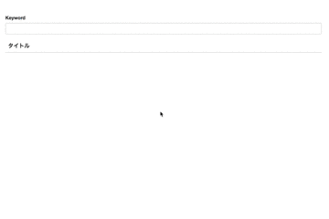

# JobがTimeout時間を超えて処理が続いている場合のqueue:listenの挙動について

```
php artisan queue:listen --timeout=600
```

と複数プロセス立ち上げて、

```
// 数分かかる処理をdispatch
php artisan queue:test
```

を叩くと、60秒置きにジョブが実行されてしまう。

# laravel-sendgrid-driverのサンプル＆ベンチマーク用コマンド

```
php artisan sendgrid:sample
```

# sleimanx2/plasticを使ってリアルタイム検索

ConnpassのAPIからイベントデータ取得してElasticSearch入れてインスタント検索してみた


